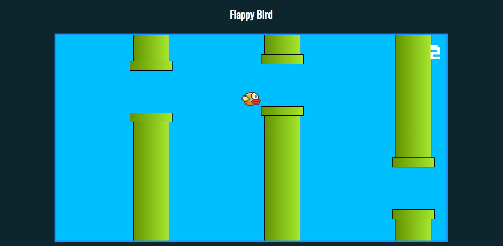

# FlappyBird

Game using HTML, CSS &amp; JS only.

This is a simplistic copy of the mobile game "Flappy Bird", that became popular after its release (2013).
It is my first code for a playable game, so I tried to focus basically on the DOM elements control.

You can play it [here](https://flappy-bird-opal.vercel.app/)

